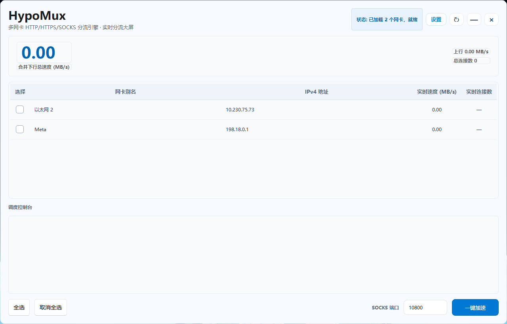

# HypoMux

<p align="center">
  <br><br>
  <a href="README.md">简体中文</a> | <a href="README_EN.md">English</a>
</p>

---

# 🇺🇸 English

<p align="center">
  
  
  
  
  
</p>

HypoMux is a multi-network-adapter bandwidth aggregation and download acceleration tool built for Windows. It is designed for multi-connection download workloads where traffic can be distributed across several active network interfaces.

Instead of modifying global routing metrics, HypoMux uses L3 socket binding (IP_UNICAST_IF) with a dual-protocol local proxy engine. It assigns different outbound connections to different selected adapters, making it useful for high-concurrency scenarios such as Steam updates and IDM large-file downloads.

In simpler terms, as long as your computer is connected to multiple networks at the same time (for example, **being plugged into a school or home Ethernet cable while also connected to Wi-Fi, or using USB tethering from a phone**), HypoMux can distribute multi-threaded download connections across those networks. Single-connection downloads are still limited by the behavior of the download source.

---

## 📷 UI Preview

<p align="center">
  
</p>

---

## ✨ Key Technical Features

* 🚀 **Seamless Dual-Protocol Interception**: Starts asynchronous SOCKS5 and local HTTP forwarding services, then applies WinINet system proxy settings when acceleration begins.
* 🔐 **Fail-Safe Proxy Restore**: Manual stop, startup failure, and window close paths all attempt to restore the system proxy cleanly.
* 📊 **5-Column Telemetry Matrix Grid**: Dynamically displays precise multi-path load distribution: [ Select | Adapter Alias | IPv4 Address | Real-time Speed (MB/s) | Active Connections ].
* ⚙️ **Pure Async Groundwork**: All PowerShell network querying, background thread interface telemetry, and async DNS processing run entirely inside a detached event loop away from the main Qt UI thread.

---

## 📖 How to Use

1. **Hardware Setup**: Hook up your PC to multiple unique lines (e.g., **Broadband Lan Wire + Mobile Phone 5G Tethering Hotspot**).
2. **Select Interfaces**: Start HypoMux, wait for the background scan worker to finish, and **check the adapters you wish to use**.
3. **Engage Acceleration**: Click **Boost**. The system proxy is applied automatically.
4. **Initiate Downloads**: Start your game update on Steam or pull a file via IDM. Watch the scheduler distribute sockets on the fly as your telemetry grid lights up.
5. **Graceful Teardown**: Click **Stop** or close HypoMux when done; the system proxy is restored automatically.

---

## 🎯 Supported Applications

Any multi-connection/multi-threaded client acknowledging standard Windows WinINet internet proxy server layouts will immediately benefit from concurrent aggregation:

* **Download Software**: **IDM (Internet Download Manager)**, Thunder (迅雷), Baidu NetDisk Client, etc.
* **Gaming Platforms**: **Steam Client Download Core**, Epic Games Launcher, EA App, Xbox Application.
* **Browsers**: Large file downloads via Chrome, Edge, Firefox, etc.

---

## 📖 Technical Architecture

HypoMux's core distribution mechanism is built on **Layer-4 application-level scheduling** and **Layer-3 physical socket binding**, without modifying the global system routing table.

```text
[Multi-threaded Application Traffic (Steam / IDM)]
               │
               ▼ WinINet Auto-Interception
    Windows System Global Registry Proxy Lock
   (http/https -> 10801 | socks -> 10800)
               │
               ▼
  ProxyWorker Core Engine (Asyncio inside QThread)
               │
               ▼ Round-Robin Connection Distribution
   L3 Physical Layer Bidirectional Socket Binding
   ├── socket.bind((nic1_ip, 0)) + IP_UNICAST_IF ──► Physical NIC 1 ──┐
   ├── socket.bind((nic2_ip, 0)) + IP_UNICAST_IF ──► Physical NIC 2 ─┼─► Aggregated Throughput
   └── socket.bind((nic3_ip, 0)) + IP_UNICAST_IF ──► Physical NIC 3 ──┘
```

1. **Full Protocol Injection**: On acceleration start, the program writes the full proxy chain to `HKCU\Software\Microsoft\Windows\CurrentVersion\Internet Settings`: `http=127.0.0.1:10801;https=127.0.0.1:10801;socks=127.0.0.1:10800`.
2. **Low-Level Dual Binding**: When the distribution engine receives a TCP connection from a download client, the scheduler pins the local NIC IPv4 address via `socket.bind()` and sends `setsockopt(socket.IPPROTO_IP, 31, ...)` to the system kernel to force-lock the physical interface index, stripping traffic away from the default gateway to achieve true physical multi-channel concurrency.

---

## 📈 Real-World Multi-NIC Benchmarks

### Case A: IDM Multi-threaded Large File Aggregation (Ubuntu ISO Mirror)
> 190 active data channels handled simultaneously. Each adapter absorbs around **35~39 MB/s** evenly, pushing combined network throughput past **110.93 MB/s**!

<p align="center">
  
</p>

### Case B: Steam High-Throughput Game Installation (*Hogwarts Legacy*)
> Flawlessly matching SteamService's multi-connection architecture, running lines concurrently to max out at **98.26 MB/s** combined downloading speed.

<p align="center">
  
</p>


### Windows Task Manager Throughput Panels
> Three unique hardware interfaces (Ethernet, Ethernet 2, Wi-Fi) pushing data at **~300 Mbps** apiece at the exact same second.

<p align="center">
  
</p>

---

## 📦 Building the Executable (Nuitka)

```powershell
venv\Scripts\activate
pip install nuitka zstandard PySide6-Fluent-Widgets
nuitka --standalone --onefile --enable-plugin=pyside6 --windows-console-mode=disable --windows-uac-admin --windows-icon-from-ico=assets/icon.ico --include-package-data=qfluentwidgets --include-data-dir=assets=assets --python-flag=-O --lto=yes main.py
```

---

## 🛡️ Security & Technical Boundaries

1. **Anti-Cheat Notice**: This tool operates at the standard application-layer proxy and network socket binding level. **It does not touch game memory, intercept or modify any game private network packets, or inject any DLL drivers**.
2. **Single-Thread Connection Limitation**: Multi-NIC concurrent aggregation is fundamentally **multi-connection load balancing**. If your download task is the extremely rare single-thread TCP connection, no multi-NIC aggregation tool can accelerate it.
3. **Low-Latency Gaming Advisory**: The multi-NIC distribution mode is optimized for download throughput. Before playing latency-sensitive competitive online games (e.g. *CS2*, *Valorant*, *GTA Online*), **please click Stop to exit the software** and let your PC network return to a normal single default gateway.

---

## 🤝 Acknowledgments

Special thanks to the following developer for their outstanding contributions to the early core stability of this project:

@Requiem_ovo

If you're also interested in multi-NIC traffic distribution and low-level network scheduling, feel free to submit a Pull Request and help improve HypoMux!

---

## 💖 Support & Sponsorship

HypoMux is an open-source project driven purely by technical passion, independently developed and maintained by the author in their spare time. The author is currently a student, and the in-depth development and daily maintenance of the project (such as frequent use of AI tools for refactoring, API testing, etc.) involve certain real costs. If you find this tool genuinely solves your networking pain points, feel free to buy the author a coffee to support the continuous iteration of this project!

> 💡 **Note:** Give within your means. Sponsorship is purely voluntary, and you can always use HypoMux's core features for free, regardless of whether you sponsor!
>
> Please leave your nickname when sponsoring!

<div align="center">
  
  <br />
  <sub>WeChat Sponsorship (Please note: HypoMux Support)</sub>
</div>


### ⚖️ Developer Statement
* **Regarding Feature Direction**: This project has a clear technical roadmap and architectural boundaries. All sponsorships are voluntary donations, and **sponsorship does not equate to commercial customization, nor can it directly determine or influence the direction of future feature development**.
* **Regarding Disclaimer**: This project is open-sourced under the **AGPL-3.0** license. The software is provided "as is", and the author assumes no liability for any direct or indirect damages resulting from the use of this tool.

### 🏆 Sponsors

Thanks to all supporters who have injected energy into HypoMux:

<a href="https://github.com/Hypostasis-Cat/HypoMux"></a>

Thank you again for your respect and support for the open-source community and independent developers!

## 📄 License

This project is licensed under the **AGPL-3.0** License.
